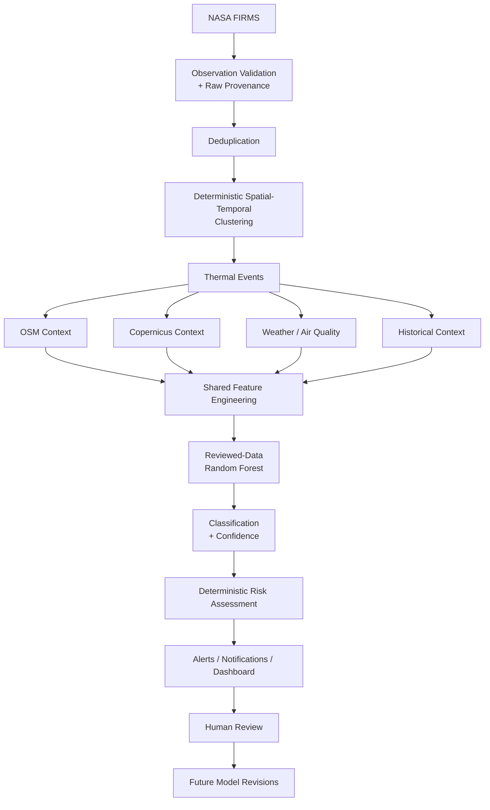

# ThermaGuard AI

> **Near-real-time satellite-based thermal anomaly detection and industrial fire risk monitoring**

ThermaGuard AI is a **Smart India Hackathon 2026** geospatial intelligence MVP that turns NASA FIRMS thermal observations into traceable thermal events, enriches them with environmental and industrial context, classifies reviewed events with machine learning, calculates a separate deterministic risk score, and presents the evidence through an operational web dashboard.

> NASA FIRMS provides **satellite-derived thermal anomaly observations**. ThermaGuard does **not** represent FIRMS as a continuous live camera or live satellite video.

---

## Project status

ThermaGuard is currently a **hackathon / engineering MVP** and is suitable for demonstrations, testing, data review, and continued model development.

### Current strengths

- Real NASA FIRMS ingestion with raw provenance
- Multi-source VIIRS / MODIS support
- Deterministic spatial-temporal event clustering
- OSM industrial-context enrichment
- Optional Copernicus, weather, air-quality, geocoding, EONET, routing, Gemini, SMTP, and Firebase integrations
- Reviewed-data Random Forest baseline
- Separate deterministic abnormality/risk engine
- JWT authentication and area-scoped authorization
- Alerts and user notification preferences
- Responsive Next.js operational dashboard
- Model metrics, provider health, review center, Intelligence Lab, System Status, reports, event comparison, data lineage, and judge/demo walkthrough
- Frontend safeguards against fabricated data and unsupported actions

### Important limitations

- This is **not** an emergency dispatch or certified safety system.
- The current ML dataset is still small and model quality must not be overstated.
- Human review remains required for training labels.
- Model V2 is **not ready** until review/evidence issues are reconciled.
- SQLite is appropriate for the current MVP, but PostgreSQL/PostGIS is the recommended production direction.
- Provider availability depends on external services and local credentials.

---

## Architecture



### Main stack

| Layer | Technology |
|---|---|
| Frontend | Next.js 15, React, TypeScript, Tailwind/CSS, Leaflet, Recharts |
| Backend | FastAPI |
| Database | SQLite + SQLAlchemy |
| ML | scikit-learn Random Forest + SimpleImputer |
| Geometry | Shapely, PyProj |
| Thermal observations | NASA FIRMS |
| Industrial/geographic context | OpenStreetMap / Overpass |
| Satellite context | Copernicus Data Space |
| Weather / air quality | Open-Meteo / CAMS |
| Geocoding | Nominatim |
| Natural hazards | NASA EONET |
| Routing | OpenRouteService |
| AI explanation | Gemini |
| Email | SMTP / Gmail STARTTLS |
| Browser push | Firebase Cloud Messaging |

The supported application pipeline does not require Pandas or GeoPandas. Optional review helpers may use Pandas separately.

---

## Core workflow

```text
FIRMS observation
→ validate
→ retain source provenance
→ deduplicate
→ cluster into thermal event
→ enrich with available context
→ derive model features
→ classify with reviewed-data model when available
→ calculate deterministic risk
→ show evidence and provenance
→ generate scoped alerts when thresholds are met
→ human review for future training
```

### Five classification classes

The current model contract uses:

- `industrial_fire`
- `persistent_industrial_thermal_source`
- `agricultural_vegetation_fire`
- `natural_thermal_event`
- `possible_false_positive`

Classification and risk are intentionally separate:

- **ML classification** answers: *What type of event does the model think this is?*
- **Deterministic risk** answers: *How operationally concerning is the available evidence under configured engineering rules?*
- **Gemini Copilot** explains authorized evidence only; it does not modify classifications, risk, labels, alerts, or database records.

---

## Frontend capabilities

The current frontend includes:

- Operational dashboard
- Live event map
- Raw FIRMS hotspot map mode
- Event register and filtering
- Event detail / evidence drawer
- Classification and risk distributions
- Provider health and stale-data states
- Model status and real evaluation metrics
- Confusion matrices and per-class metrics
- Read-only review center
- Intelligence Lab
- Sensor provenance
- Event timelines
- Data lineage
- Event comparison
- Local-only watchlists
- Supported natural-language filter helpers
- Historical summaries
- System Status
- Alerts and notification settings
- Firebase browser-push registration flow
- Print-friendly reports
- Judge/demo walkthrough
- Install manifest and safe offline shell
- Responsive layouts for mobile, tablet, and desktop

Unsupported backend workflows such as review writes, model rollback, reviewer consensus, SHAP explanations, and formal drift monitoring remain disabled or explicitly marked as future contracts rather than being fabricated.

---

## Setup

### Requirements

Recommended:

- Python **3.12+**
- Node.js **22+**
- npm
- macOS/Linux shell commands shown below

Run backend commands from the repository root so the relative SQLite URL consistently resolves to the same database.

### 1. Clone and enter the project

```bash
git clone https://github.com/chandannmahatoo/ThermaGuard-AI.git
cd ThermaGuard-AI
```

### 2. Python environment

```bash
python3 -m venv .venv

./.venv/bin/python -m pip install -r backend/requirements.txt
```

### 3. Environment files

```bash
cp backend/.env.example backend/.env
cp frontend/.env.example frontend/.env.local
```

Do not overwrite an existing configured `.env`.

Provider credentials and secrets belong only in ignored environment files.

### 4. Frontend dependencies

```bash
npm --prefix frontend ci
```

### 5. Start backend

```bash
PYTHONPATH=backend ./.venv/bin/python -m uvicorn app.main:app \
  --reload \
  --host 127.0.0.1 \
  --port 8000
```

### 6. Start frontend

In a second terminal from the repository root:

```bash
npm --prefix frontend run dev
```

Open:

```text
http://127.0.0.1:3000
```

---

## Demo mode

Set:

```env
DEMO_MODE=true
```

Demo credentials are intentionally documented for **local demo mode only**:

```text
Password: DemoTherma2026!

admin@demo.thermaguard.local
operator@demo.thermaguard.local
```

Demo data is fictional and clearly separated using `is_demo=true`.

---

## Real mode

Set:

```env
DEMO_MODE=false
```

Configure at minimum:

- a strong `JWT_SECRET`
- a valid `FIRMS_MAP_KEY`
- a separate real-mode database

Create an administrator interactively:

```bash
PYTHONPATH=backend ./.venv/bin/python -m app.bootstrap
```

Then synchronize FIRMS from **System Status** or through the API.

Prefer **bounded regional ingestion** rather than repeatedly synchronizing the entire country during development.

---

## FIRMS sources

Use:

```text
GET /api/v1/firms/sources
```

to inspect supported datasets and current availability windows.

Supported source families include:

### Near-real-time

- `VIIRS_SNPP_NRT`
- `VIIRS_NOAA20_NRT`
- `VIIRS_NOAA21_NRT`
- `MODIS_NRT`

### Standard-processing / historical

- `VIIRS_SNPP_SP`
- `VIIRS_NOAA20_SP`
- `MODIS_SP`

Raw FIRMS detections are **observations**. ThermaGuard thermal events are **clusters of observations**. Human-reviewed events are the **training units**.

Collecting additional FIRMS data does not automatically create labels or retrain the model.

---

## External context providers

| Provider | Purpose |
|---|---|
| OSM / Overpass | Industrial and geographic proximity context |
| Copernicus | Sentinel-2 statistical satellite context / NDVI |
| Open-Meteo | Weather |
| CAMS / Open-Meteo | Air-quality context |
| Nominatim | Reverse geocoding |
| NASA EONET | Nearby/current natural hazard context |
| OpenRouteService | Driving route to response points |
| Gemini | Evidence-grounded explanation |
| SMTP | Subscribed email alerts |
| Firebase | Browser push alerts |

Missing context is reported as unavailable with an explicit reason. ThermaGuard does not infer missing provider evidence.

Provider status is available through:

```text
GET /api/v1/providers/status
```

---

## Authentication and authorization

`/health` is public.

Operational event, model, analytics, alert, provider, and Copilot routes require authentication.

Administrative actions include:

- FIRMS synchronization
- model training
- organization management
- area assignments
- user organization linking
- selected diagnostics

Authorization is enforced in the backend. The frontend is not the security boundary.

---

## Main API surface

Interactive API documentation:

```text
http://127.0.0.1:8000/docs
```

Major routes include:

```text
/health

/api/v1/auth/register
/api/v1/auth/login
/api/v1/auth/me
/api/v1/auth/notifications
/api/v1/auth/push-device

/api/v1/firms/sources
/api/v1/firms/sync
/api/v1/firms/status
/api/v1/firms/history/backfill

/api/v1/events
/api/v1/events/{id}/evidence
/api/v1/events/{id}/history
/api/v1/events/{id}/risk
/api/v1/events/{id}/route

/api/v1/analytics/summary
/api/v1/analytics/trends

/api/v1/model/status
/api/v1/model/train
/api/v1/model/metrics
/api/v1/model/review-readiness
/api/v1/model/review-candidates

/api/v1/alerts
/api/v1/alerts/{id}/acknowledge

/api/v1/providers/status
/api/v1/eonet/events

/api/v1/admin/organizations
/api/v1/admin/assignments
/api/v1/admin/users/assign
/api/v1/admin/threshold

/api/v1/areas/search
/api/v1/copilot/chat
```

The exact OpenAPI contract is authoritative.

---

## Model and training status

ThermaGuard currently has an existing **baseline reviewed-data Random Forest workflow**.

A local model artifact may exist in an active development workspace, but model files are intentionally git-ignored and may not exist in a fresh clone.

The current baseline review set historically contains **33 eligible published review rows**.

However:

> **Model V2 is not ready.**

The original reviewed rows require review/evidence reconciliation before they should be treated as a clean foundation for the next model revision.

Current minimum readiness gate:

```text
>= 30 eligible rows
all 5 classes
>= 10 independent groups
```

Training also requires leakage-safe train/validation/test coverage.

A dataset can pass the minimum gate and still be too small for stable scientific conclusions.

---

## Human review workflow

Export review candidates:

```bash
PYTHONPATH=backend ./.venv/bin/python backend/export_review_candidates.py
```

Check progress:

```bash
PYTHONPATH=backend ./.venv/bin/python backend/review_progress.py
```

Model V2-oriented status:

```bash
PYTHONPATH=backend ./.venv/bin/python backend/review_progress.py --v2
```

Dry-run source reconciliation:

```bash
PYTHONPATH=backend ./.venv/bin/python backend/review_progress.py --reconcile-sources
```

Finalize only valid reviewed rows:

```bash
PYTHONPATH=backend ./.venv/bin/python backend/finalize_reviewed_labels.py
```

Do not bypass stale-evidence or review-metadata safeguards simply to make training proceed.

---

## Current local acquisition snapshot

A documented local development checkpoint contains:

```text
790 real FIRMS detections
405 clustered events
372 unreviewed candidate events
```

An earlier controlled multi-source collection contained:

```text
651 real observations
297 events
264 new unreviewed candidates
all 7 supported FIRMS sources represented
```

These are local development checkpoints, not guaranteed counts for every clone or future database state.

---

## Alerts and notifications

Dashboard alerts remain available even if external notification delivery fails.

### Email

SMTP uses STARTTLS. Gmail deployments should use a Google App Password rather than a normal Gmail password.

### Firebase push

Firebase browser push requires:

- backend Firebase project/service-account configuration
- frontend browser configuration
- VAPID configuration
- explicit device registration

The frontend should not report success until backend registration succeeds.

---

## Gemini Copilot

Gemini is used only for explanation over authorized event evidence.

It does not:

- become the classification source of truth
- calculate deterministic risk
- write human labels
- acknowledge alerts
- modify database records
- invent unavailable evidence

---

## Verification

Backend:

```bash
./.venv/bin/python -m pip check

./.venv/bin/python -m py_compile backend/app/*.py

PYTHONPATH=backend ./.venv/bin/pytest backend/tests -q
```

Frontend:

```bash
npm --prefix frontend run typecheck

npm --prefix frontend run build

npm --prefix frontend test

npm --prefix frontend run test:e2e
```

Latest documented frontend validation:

```text
TypeScript: passed
Production build: passed
Unit/component tests: 101 passed
Playwright E2E tests: 22 passed
```

Responsive E2E coverage included:

```text
320px
375px
768px
1024px
1440px
```

These tests verify application behavior but do **not** establish scientific model validity or live external-provider availability.

---

## Known limitations

Current limitations include:

- hackathon/local MVP architecture
- SQLite rather than production PostGIS
- small reviewed ML dataset
- Model V2 not ready
- review/evidence reconciliation still required
- deterministic single-linkage clustering
- O(n²) clustering behavior
- active-dataset rebuild behavior during sync
- bounded external-provider enrichment
- OSM completeness variability
- incomplete relation-geometry support
- no distributed background worker system
- no durable notification retry queue
- no MFA
- no password recovery
- no full production migration framework
- no complete immutable audit trail
- no atomic multi-process model activation
- no formal drift monitoring
- no production-grade reviewer-consensus workflow

---

## Production roadmap

Before production use:

1. Validate labels and thresholds with domain experts.
2. Stabilize event identity and reviewed-evidence workflows.
3. Expand high-quality human-reviewed data.
4. Improve class, geographic, temporal, and sensor diversity.
5. Re-evaluate the baseline model on trustworthy held-out data.
6. Add dataset/model versioning and atomic activation.
7. Migrate to PostgreSQL/PostGIS.
8. Add migrations and spatial/time indexes.
9. Improve provider caching and scheduled retrieval.
10. Add durable background-task and notification queues.
11. Add robust audit logs and retention policies.
12. Harden authentication with MFA and account recovery.
13. Add production observability and deployment controls.
14. Validate the complete system with domain stakeholders.

---

## Documentation

Key documentation includes:

```text
docs/ARCHITECTURE.md
docs/DATA.md
docs/MODEL.md
docs/REVIEW_ACQUISITION.md
docs/REVIEW_ACQUISITION_REPORT.md
docs/RUNTIME_RELIABILITY.md
docs/CLEANUP_MANIFEST.md

frontend/docs/FRONTEND_AUDIT.md
frontend/docs/FRONTEND_IMPLEMENTATION.md
frontend/docs/FEATURE_MATRIX.md
frontend/docs/INTELLIGENCE_IMPLEMENTATION.md
```

The current executable code and OpenAPI contract should be treated as authoritative when older documentation describes an earlier checkpoint.

---

## Project principle

> **Observed facts, model interpretation, deterministic risk, and AI explanation must remain clearly distinguishable.**

ThermaGuard should prefer:

```text
Unavailable
```

over invented values,

```text
Human verification required
```

over automatic ground truth,

and:

```text
Evidence changed — review again
```

over silently preserving an outdated label.

---

## Disclaimer

ThermaGuard AI is a student-built hackathon and research-oriented engineering prototype.

It is **not** a certified emergency-response, industrial-safety, environmental-compliance, or disaster-management system.

Operational decisions must not rely on ThermaGuard without independent verification and appropriate domain expertise.
