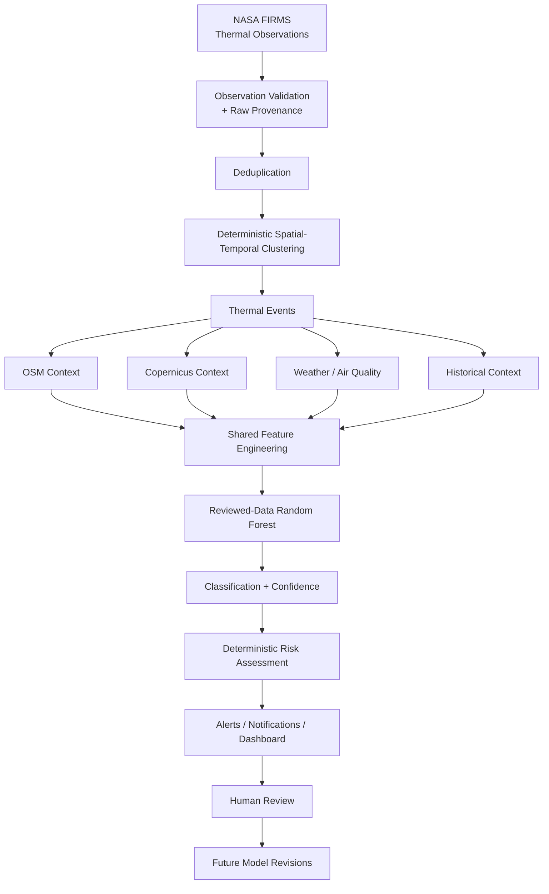

# Architecture

Detect → validate → cluster → enrich → build shared features → classify only with a trained artifact → compare historical behavior → score risk → authorize → present/notify.

`backend/app/main.py` owns HTTP orchestration, provider status and transactional event processing. `database.py` stores users, organizations, bounds assignments, provenance-bearing detections and events, and organization alerts. Event context, features, classification and risk are embedded JSON, avoiding duplicate tables. `providers.py` contains the FIRMS, OSM and Copernicus satellite context clients. `intelligence.py` owns clustering, features and risk. `ml.py` owns reviewed-data readiness, grouped training and prediction. `security.py` owns password hashing, JWT, failed-login throttling and geographic access. `bootstrap.py` creates a real administrator without a source-controlled password.

The frontend uses a compact workspace with a client-only Leaflet map, event detail drawer, model/review views, Intelligence Lab, System Status and Copilot panel. Server roles and geographic bounds, not UI visibility, enforce data access.

External HTTP requests have explicit timeouts and identify the project with a User-Agent header. FIRMS failure returns an error while existing stored data remains available. OSM failure records unavailable context. Copernicus satellite context reports explicit unavailability rather than fabricating values. Gemini errors fall back to deterministic evidence summaries. SMTP failures do not remove dashboard alerts.

Analytics windows support 24h, 7d, 30d and 365d. When no records exist in the selected window, the API returns:

```json
{
  "available": false,
  "reason": "insufficient_history"
}
```

The frontend displays an explicit insufficient-history state instead of inventing chart data.

The backend is currently designed for a single-process local MVP. SQLite and JSON keep setup simple; PostgreSQL/PostGIS, production indexing, migrations and transactional model activation remain future work.

Clustering groups nearby detections in space and time; it does not classify them. The Random Forest classifies, the deterministic risk engine scores, and Gemini explains authorized evidence without writing events or labels.

---

## System Workflow



---

## Data Policy and Sources

NASA FIRMS observations follow the official area CSV API.

The system validates:

- latitude
- longitude
- acquisition date/time
- FRP
- brightness
- sensor-specific confidence

Confidence is preserved in its original sensor-specific form and is not treated as model confidence.

The system retains:

- raw source row
- source identity
- retrieval time
- observation time
- provider
- processing version
- demo flag
- sensor / instrument metadata
- scan / track information
- source-specific thermal measurements

Deduplication uses observation identity rather than mutable retrieval timestamps.

---

## OpenStreetMap Context

OpenStreetMap context is retrieved through Overpass.

Supported context includes:

- industrial land
- refineries
- factories
- thermal power plants
- forest
- farmland
- residential areas
- facility counts
- land-use class at the event location

Distances are calculated using projected geometry rather than simple polygon-center distance where possible.

No OSM match means:

> unknown beyond the query coverage

It must not be interpreted as proof that no facility exists.

Complex relations without usable geometry may be skipped.

OpenStreetMap attribution must be preserved.

---

## Satellite Context

Satellite context is retrieved from the Copernicus Data Space Statistical API.

Current workflow:

- Sentinel-2 L2A
- bounded area around event
- least-cloudy mosaicking
- server-side NDVI evaluation
- compact statistics only
- no complete scene/raster downloads

Successful results may contain:

- mean NDVI
- sample count
- acquisition interval/date
- provider provenance

If real pixels are unavailable, values remain null and an explicit reason is returned.

Examples:

```text
credentials_missing
provider_unavailable
demo_mode
```

Built-up and land-cover fractions remain unavailable unless actually implemented.

Do not replace them with synthetic values.

---

## Demo Data Policy

`data/demo/detections.csv` is the deterministic demo fixture.

Demo observations:

- are fictional
- use illustrative coordinates
- have `is_demo=true`
- remain separate from real observations
- cannot be used as real training evidence

Real synchronization is blocked in demo mode.

Training requires explicitly reviewed, non-demo records.

---

## Human Review Workflow

Export review candidates:

```bash
PYTHONPATH=backend ./.venv/bin/python backend/export_review_candidates.py
```

Output:

```text
data/review_candidates.csv
```

The exporter preserves manual review fields when an event remains compatible.

Human reviewers are responsible for fields such as:

```text
label
split_group
reviewer
source_reference
reviewed
reviewed_at
review_notes
```

The canonical workflow never automatically converts model predictions into ground-truth labels.

Validation:

```bash
PYTHONPATH=backend ./.venv/bin/python backend/validate_review_candidates.py
```

Finalize reviewed rows:

```bash
PYTHONPATH=backend ./.venv/bin/python backend/finalize_reviewed_labels.py
```

Output:

```text
data/reviewed_labels.csv
```

The finalizer rejects incomplete or invalid reviewed rows instead of silently publishing them.

---

## Reviewer Safety

Useful read-only tools:

```bash
PYTHONPATH=backend ./.venv/bin/python \
backend/review_event_summary.py EVENT_ID
```

```bash
PYTHONPATH=backend ./.venv/bin/python \
backend/prepare_review_row.py EVENT_ID
```

Progress:

```bash
PYTHONPATH=backend ./.venv/bin/python \
backend/review_progress.py
```

Model V2 status:

```bash
PYTHONPATH=backend ./.venv/bin/python \
backend/review_progress.py --v2
```

Dry-run provenance reconciliation:

```bash
PYTHONPATH=backend ./.venv/bin/python \
backend/review_progress.py --reconcile-sources
```

Review tools must not:

- generate ground-truth labels
- approve their own suggestions
- fabricate reviewers
- fabricate timestamps
- overwrite reviewed evidence silently

---

## Multi-Source FIRMS Ingestion

Supported source metadata is exposed through:

```text
GET /api/v1/firms/sources
```

Supported source families include:

### NRT

```text
VIIRS_SNPP_NRT
VIIRS_NOAA20_NRT
VIIRS_NOAA21_NRT
MODIS_NRT
```

### Historical / Standard Processing

```text
VIIRS_SNPP_SP
VIIRS_NOAA20_SP
MODIS_SP
```

The provider intersects configured sources with NASA FIRMS availability metadata.

Unsupported or unavailable source/date combinations are rejected rather than guessed.

---

## Live FIRMS Sync

Endpoint:

```text
POST /api/v1/firms/sync
```

Example:

```json
{
  "sources": [
    "VIIRS_SNPP_NRT",
    "VIIRS_NOAA20_NRT"
  ],
  "bounds": [72.5, 21.0, 72.8, 21.2],
  "days": 1
}
```

The combined accepted-observation budget is checked before persistence.

Provider failures must not result in silently fabricated observations.

---

## Historical FIRMS Backfill

Historical endpoint:

```text
POST /api/v1/firms/history/backfill
```

Historical collection:

- validates the requested source/date interval
- uses available source metadata
- chunks requests into bounded date windows
- preserves idempotency
- suppresses live notifications
- avoids automatic model training
- keeps provenance

SP products are preferred for historical collection when available.

---

## Observation Identity

Observation identity is derived from fields such as:

- dataset
- satellite
- instrument
- normalized latitude
- normalized longitude
- UTC observation time

Retrieval time does not create a new observation.

Different sensors remain separate observations even when they describe the same physical event.

NRT and SP records can represent the same physical overpass, so source counts must not automatically be interpreted as independent confirmations.

---

## Raw Detection API

Authorized raw observations are exposed through:

```text
GET /api/v1/firms/detections?offset=0&limit=100
```

Maximum page size:

```text
500
```

Returned observations respect the same authorization boundary as visible events.

A raw marker represents one FIRMS observation.

An event marker represents a spatial-temporal cluster.

Neither constitutes human review.

---

## ML Responsibilities

The machine-learning pipeline:

- uses reviewed-only training records
- excludes demo records
- uses group-aware splitting
- preserves a fixed feature contract
- tracks feature version
- persists model metadata
- evaluates on held-out data
- returns null classification when no compatible trained artifact exists

The current baseline uses a Random Forest with imputation.

Classification is separate from risk.

---

## Five Current Classification Classes

```text
industrial_fire
persistent_industrial_thermal_source
agricultural_vegetation_fire
natural_thermal_event
possible_false_positive
```

These are the model output classes.

They must not be treated as human ground truth unless confirmed by review.

---

## Risk Engine

Risk is deterministic and separate from ML probability.

Conceptually:

```text
event evidence
→ configured engineering weights
→ deterministic risk score
→ risk level
→ alert threshold evaluation
```

Risk weights are heuristics, not validated safety estimates.

---

## Gemini Copilot

Gemini receives only bounded authorized evidence.

It can:

- explain an event
- summarize evidence
- explain classification
- explain risk
- describe missing context
- compare available history

It cannot:

- modify classification
- modify risk
- write labels
- update events
- acknowledge alerts
- change database records

Missing information must remain explicitly unavailable.

---

## Alerts and Notifications

Alerts are generated from configured deterministic-risk thresholds.

Notification channels may include:

- dashboard
- email
- Firebase browser push

Provider failure does not remove the underlying alert.

Notification delivery and event classification remain independent.

---

## Authorization

Authorization is enforced in the backend.

Relevant controls include:

- authenticated user
- organization
- assigned geographic area
- admin privileges
- event visibility
- alert ownership

Frontend hiding is not a security mechanism.

---

## Provider Failure Policy

Provider failures are isolated.

Examples:

```text
FIRMS failure
→ sync fails safely

OSM failure
→ event remains available with context unavailable

Copernicus failure
→ NDVI remains null

Weather/AQ failure
→ provider context unavailable

Gemini failure
→ deterministic explanation fallback

SMTP failure
→ dashboard alert remains available
```

The system must prefer:

```text
Unavailable
```

over fabricated values.

---

## Key Principle

ThermaGuard keeps four concepts separate:

```text
Observed Evidence
      ↓
ML Interpretation
      ↓
Deterministic Risk
      ↓
AI Explanation
```

These must not be merged into a single opaque "AI result".

---

## Production Direction

Future engineering work includes:

- PostgreSQL/PostGIS
- database migrations
- spatial/time indexes
- stable event identity
- reviewed-evidence versioning
- dataset versioning
- model registry
- atomic model activation
- background task workers
- durable notification retries
- immutable audit logs
- MFA
- account recovery
- formal drift monitoring
- reviewer consensus workflow
- domain validation

---

## Disclaimer

ThermaGuard AI is a hackathon and research-oriented engineering prototype.

It is not a certified:

- emergency-response platform
- industrial-safety system
- disaster-management system
- environmental-compliance system

Any operational use requires independent verification and appropriate domain expertise.
